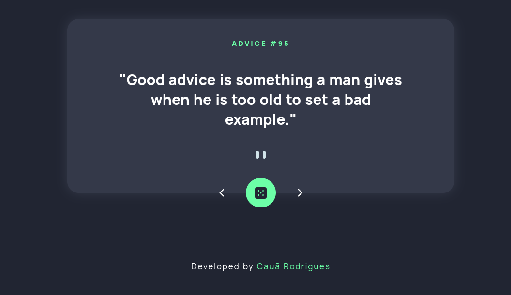

<h1 align="center">Advice and Phrase Generator</h1>

---

<h2 align="center">💡 <a href="https://coach-app.netlify.app/" target="_blank">AdvicesApp</a> 🚀 Concluído ✅ </h2>

Desafio proposto pelo [Frontend Mentor Challenge](https://www.frontendmentor.io/challenges/advice-generator-app-QdUG-13db) e concluído. A aplicação consiste em gerar conselhos e frases através da API [Advice](https://api.adviceslip.com/), utilizando qualquer linguagem ou tecnologia.  

Decidi aumentar a dificuldade do desafio e fazer um maior proveito da API adicionando outras funcionalidades, como: Slider de botãos, pesquisar por conselhos e copiar frase para a área de transferência. Nos demais aspectos eu seguei inteiramente o design proposto pelo Frontend Mentor.

---

## 🔧⚒️ Tecnologias

Foram utilizadas as seguintes tecnologias:
- ReactJs
- JavaScript
- Axios
- CSS
- HTML

---

### 🧑‍💻 Desenvolvedor

<a href="https://github.com/CauaRodrigues" target="_blank">

 
<b>Cauã Rodrigues</b>
</a>

 

---
## 📝 Licença

Este projeto esta sobe a licença [MIT](License.md).
